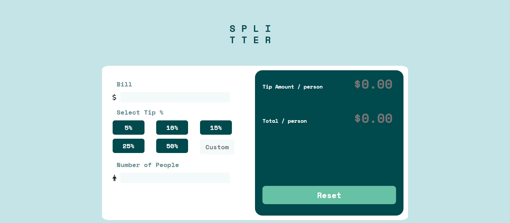
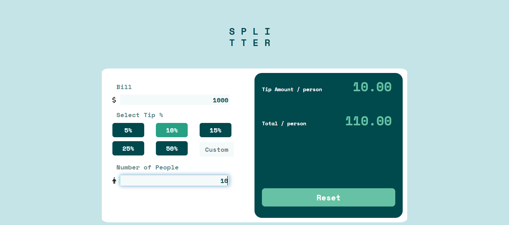

# Tip Calculator App Solution

This is a solution to the [Tip calculator app challenge on Frontend Mentor](https://www.frontendmentor.io/challenges/tip-calculator-app-ugJNGbJUX). 

## Table of contents

- [Overview](#overview)
  - [The challenge](#the-challenge)
  - [Screenshot](#screenshot)
  - [Links](#links)
- [My process](#my-process)
  - [Built with](#built-with)
- [Author](#author)

## Overview

### The challenge

Users should be able to:

- View the optimal layout for the app depending on their device's screen size
- See hover states for all interactive elements on the page
- Calculate the correct tip and total cost of the bill per person

### Screenshot

### Links

- Solution URL: [Click Here](https://github.com/chayansurana3/P6-Tip-Calculator-App.git)
- Live Site URL: [Click Here](https://chayansurana3.github.io/P6-Tip-Calculator-App/)

### Built with

- Semantic HTML5 markup
- CSS custom properties
- Vanilla JavaScript

## Author
- Frontend Mentor - [@chayansurana3](https://www.frontendmentor.io/profile/chayansurana3)
- Twitter - [@chayan_surana_](https://twitter.com/chayan_surana_)

